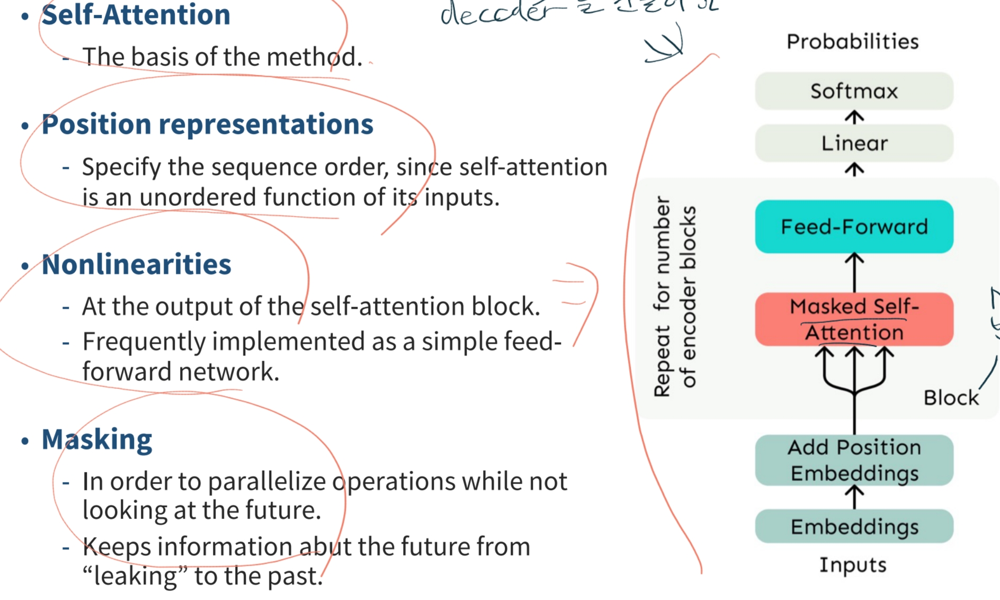

# Attention(2)
Attention은 SeqToSeq를 더 잘만들기 위해서 나왔다. 앞서 설명했던 SeqToSeq의 경우 Encoder RNN의 끝 부분에 압축정보를 보관하고 Decoder RNN에서 가져다 쓴다고 설명했는데 이 부분에 있어서 병목현상이 발생할 수 있다.

Attention 매커니즘은 이러한 병목현상을 해결해주는 솔루션이다. 핵심적인 개념은 decoder의 각 단계에서, source sequence의 특정 부분에 초점을 맞추기 위해 encoder에 직접 연결하는 것이다.

## Attention Process

1. encoder hidden state(value), decoder hidden state(query), timestep t를 가진다.
2. decoder 벡터에서 encoder 벡터로 내적을 하여 attention score를 구한다.
2. attention score에 softmax를 적용하여 확률분포를 구한다. 이는 attention weights로 어느 입력 요소에 더 집중해야 할지를 나타낸다.
3. attention 가중치를 각 hidden state에 곱하고 마지막에 더해서 attention ouput을 구한다.
4. decoder hidden state와 attention output을 계산하여 다음 단어를 예측한다.

## Attention 장점
1. NMT 성능을 의미있게 향상시킨다.
2. 좀 더 사람 같이 작동하게 한다.
3. 병목현상을 해결한다.
4. 기울기 소실 문제를 해결하는데 도움을 준다.(지름길 생성을 통해)
5. 딥러닝은 원래 내부적으로 어떻게 작동하는지 모르지만 해석 가능성을 제공해준다. 표로 나타내면 아래와 같다.
   

> RNN은 기본적으로 순차적으로 데이터를 처리하는데 적합한 구조로, 현재시점에서 정보 전달거리가 먼 경우 영향력이 약해지는 장기의존성 문제가 발생합니다.
> 앞서 언급했듯이 정보가 timestamp마다 전달되면서 점차 소실되거나 왜곡되는 경우가 있다. 또한 backpropagation 시에 vanishing gradient 문제가 발생합니다.
>  또한 RNN은 순차적으로 진행되기에 병렬적인 계산이 안되고, 이는 GPU를 효율적으로 사용 못한다는 뜻입니다. 즉, 큰 아키텍처가 불가하고 성능향상에 한계가 있음을 말합니다.
> 

## Self-Attention
Self-Attention은 입력 데이터 시퀀스의 각 요소가 스스로 다른 요소들과 상호작용하면서 정보를 추출하는 방식이다.
즉, 시퀀스 내에서 각 위치의 단어가 다른 모든 위치의 단어들과의 관계를 계산하여, 그 상호작용에 따라 중요한 정보를 추출합니다.
이를 통해 멀리 떨어진 위치에 있는 단어들 간에도 상호작용을 쉽게 모델링할 수 있습니다.

### 주요 프로세스
1. Query, Key, Value 벡터로 변환
   * Query: 정보를 찾고자 하는 질문
   * Key: 다른 요소들과의 유사도를 비교하는 키
   * Value: 최종적으로 반영되는 정보
2. 유사도 계산
   각 Query Vector와 Key Vector를 내적하여 유사도를 계산한다.
3. Attention Weight 계산
   유사도를 계산 후, softmax 함수로 변환하여 각 요소에 대한 가중치를 구합니다.
4. 가중합 계산
   각 요소의 Value Vector에 계산된 가중치를 곱해 가중합을 구한다. 이게 **Self-Attention**의 결과이다.

### Example

learned 다음에 뭐가 나올까?에서 CS가 유사도가 높아 highlight라고 볼 수 있다.

### Self-Attention의 허들과 해결방안 {id="self-attention_2"}
|-|-|
|**허들**|**해결방안**|
|순서에 대한 정보가 없다.|position embedding 추가|
|NN에서 layer 사이사이에 nonlinear func을 넣어줘야하는데 없다|모듈의 추가(feed-forward network 같은...)|
|단어 생성 시 미래정보를 알고있으면 안됨|미래에 대한 정보는 마스킹|

> **position embedding**은 어떻게 주나? 
> 1. 처음엔 노이즈 형태로 주었음
> 2. 다음엔 절대적 위치를 많이 쓰고
> 3. relative position 혹은 rotary position을 쓴다.
 
> **비선형성 추가하는 방법** 
> Self-Attention만으로는 충분히 복잡한 변환과 비선형성을 제공하기 어렵기 때문에 Feed-Forward Network를 추가한다.
>  Feed-Forward Network는 일반적으로 두 개의 선형 변환 사이에 ReLU나 GELU와 같은 비선형 활성화 함수를 사용한다.
> 

> **masking 하는 방법** 
> decoder에서 self-attention을 사용하려면 생성 시 미래를 몰라야 한다. 그래서 각 timestamp마다 key, query 세트를 과거만 포함하도록 변경한다.
> 병렬화를 가능하게 하려면 attention score를 음의 무한으로 표현한다.
> 
 
### 결론적으로 Self-Attention의 전체적인 프로세스는 아래와 같다. {id="self-attention_1"}

