# Language Modeling
언어 모델링은 다음에 어떤 단어가 올지 예측하는 작업이다.
(context가 있을 때 다음에 나오는 단어를 종합적으로 고려하여 예측) 

- DDA(Data Driven Approach) 기반이기 때문에 정답이 되는 데이터를 가지고 있다.
- 특정 도메인을 학습시키면 해당 도메인의 관련 용어가 많이 나온다.
- 공식(formal)으로 접근하면 아래와 같다.(words sequence가 주어지면 다음 단어의 확률분포를 계산)
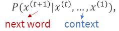
- 공식에 대한 예시로서 어떤 문장이 완성되는 확률을 표현하면 아래와 같다.
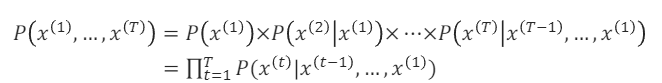
- 예시로 문자 자동완성, 교정(구글 검색, 스마트폰 키보드), Chatbot System(gpt, claude, gemini), 음성 인식, 번역이 있다.

## N-gram Language Models
N-gram 언어 모델은 LM을 구현하는 기본적이고 고전적인 방법이다. 
n은 context length를 의미한다.

- 종류는 Unigrams(1개), Bigrams(2개), Trigrams(3개), Four-grams(4개)가 있다.
- 수학적 표현으로 Markov 가정으로 쓰며 아래와 같다.
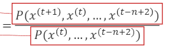
- 4개를 기준으로 확률을 어떻게 구하는지 알아보자.
>1. 문장에서 4개를 제외한 부분은 날리고, 아래와 같이 카운팅한다.
>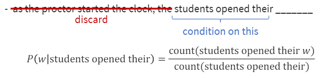
>2. 분모가 100, 분자가 5라고 가정하면, 지금까지 학습한 데이터에서 분모는 100번, 분자는 5번 나왔다는 뜻이다.
>3. 그렇게 w가 나올 확률(P)은 0.05가 되며 확률이 가장 높은 단어가 예측된다.
>4. **한계**는 길이에 제한이 있어 앞에 내용을 날려서 추론이 어려워지고 비합리적인 결과가 나올 가능성이 있다.
>5. 길이를 늘리게 되면 희소성 문제가 악화되고 모델 크기가 늘어난다.

## Fixed-window Neural Language model
신경망을 이용해 단어 임베딩 벡터의 의미적 관계를 학습하며, n-gram을 개선했으며 **희소성 문제를 극복**할 수 있지만 **고정된 길이의 한계**가 있다.
고정된 문맥 길이의 제한이 있다보니 **장기의존성 문제**가 생겨 긴 문장에서 앞 부분의 중요한 정보가 뒷 부분에 영향이 있는 경우 해당 정보를 놓칠 수가 있습니다.

## RNN {id="rnn_1"}
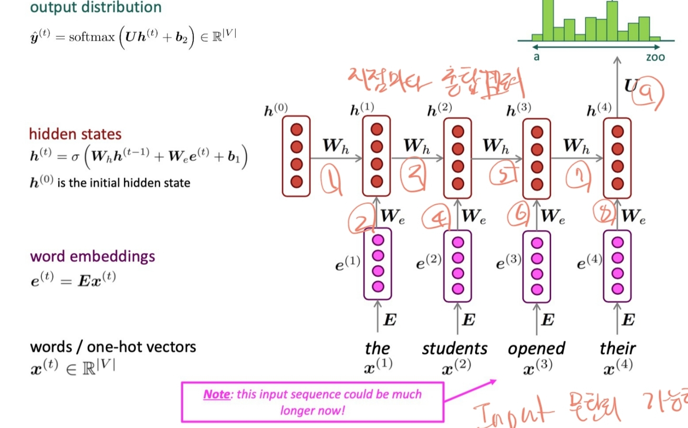
RNN은 순환신경망으로, 시퀀스 데이터를 처리하기에 적합한 구조를 가진 인공신경망입니다. RNN은 일반적인 신경망과는 달리 순차적 데이터를 처리하고, 시간 의존성을 학습할 수 있는 특징이 있습니다.
RNN은 이전 단계의 출력을 현재 단계의 입력으로 활용하며, 이를 통해 시계열 데이터를 효율적으로 다룰 수 있습니다.
* RNN의 핵심은 순환 구조에 있다. 각 timestep마다 입력을 받으며, 그 이전 단계에서 나온 출력을 현재 단계의 입력과 함께 처리한다.
* 장기의존성에서 구조적으로 능력이 제한되는데 **기울기 소실(gradient vanishing)** 때문이다.

### RNN의 이점
1. 길이에 상관이 없음.
2. 이전 단계의 정보를 사용할 수 있다.
3. 입력량에 따른 모델 사이즈 변경이 없다.
4. 각 step별로 같은 가중치가 적용되므로 대칭성이 있다.

### RNN의 단점
1. 반복 계산이 느리다.
2. 실제로 여러 단계 뒤에 있는 정보에 접근하기가 어렵다.

### RNN의 teacher forcing
이전의 출력을 다음 단계의 입력으로 사용한다. 다만 예측이 한번 잘못되면 누적이 되어 악영향을 줄 수 있다.
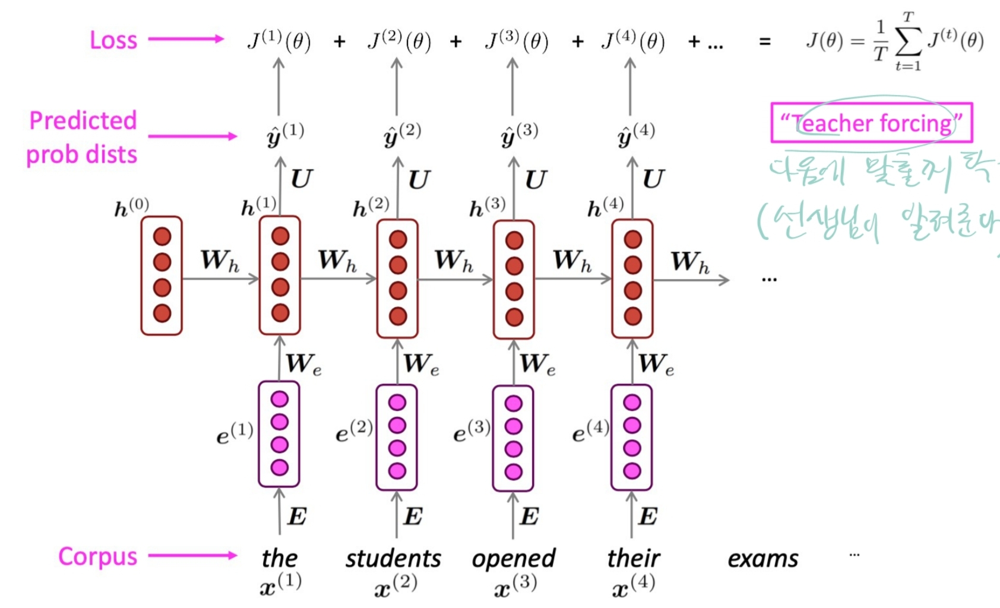

### RNN의 backpropagation
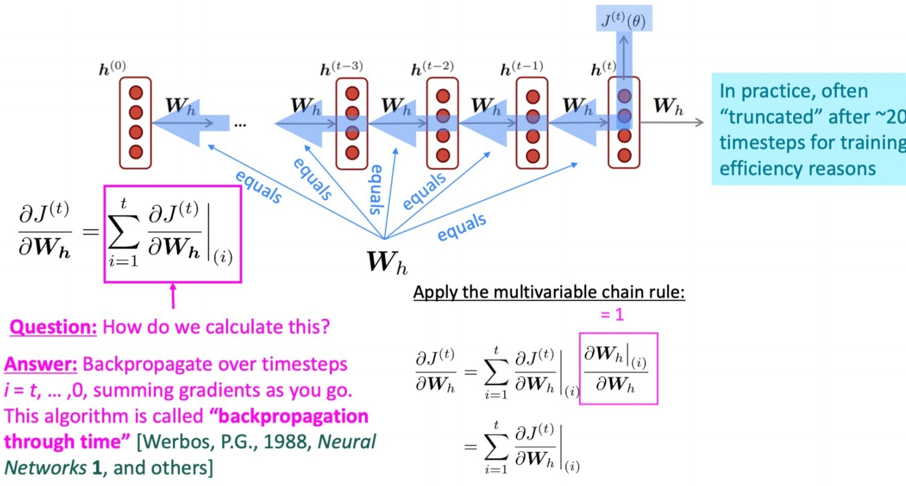

### RNN의 평가 방법
평가 방법에는 여러가지가 있지만 대표적으로는 아래의 방법들이 있다.
1. Perplexity(혼란도)
perplexity는 모델이 얼마나 다음 단어를 잘 예측하는지 평가한다. RNN에서 다음 단어의 확률 분포를 계산하고, 그 분포가 얼마나 '혼란스러운지'를 나타낸다.
낮은 perplexity 값은 모델이 다음 단어를 잘 예측한다는 것을 의미한다.(4일 경우, 4번의 기회면 무조건 맞춘다)
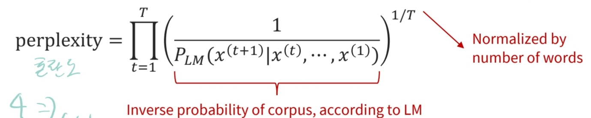
2. Loss Function
모델의 예측과 실제 정답 사이의 차이를 측정하는데 사용된다. Cross-Entropy Loss는 분류 문제에서 자주 사용되는데 아래와 같은 수식이다.
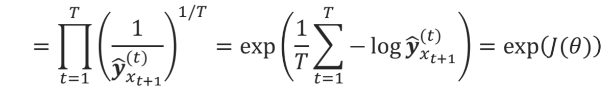

### RNN의 Gradient Vanishing
기울기가 작을수록 모델은 보다 긴 문장에서 의존성을 배울 수 없고, 정확한 예측이 어렵다.
에러시그널이 거리가 멀수록 손실이 더 되고, 실질적으로 간단한 RNN은 7개까지의 토큰만 조건화 한다.
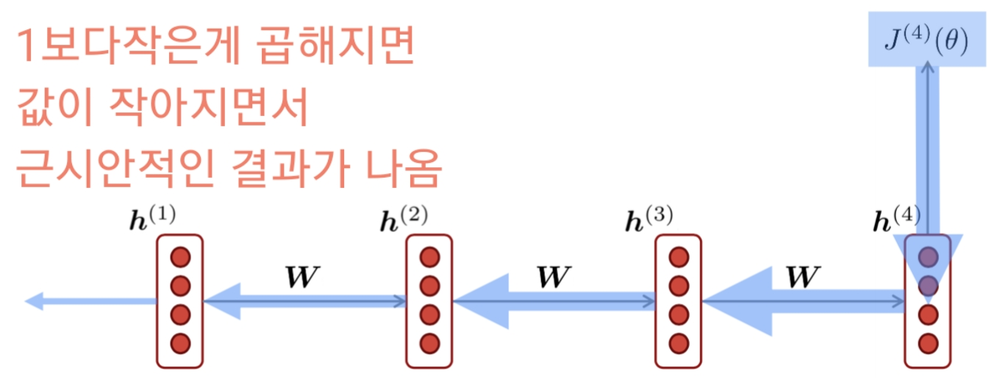

이러한 문제들이 RNN이 많은 timestamp에 걸쳐 정보를 보존하는게 어렵다는 것이다.

## Long Short-Term Memory(LSTM)
RNN의 gradient vanishing 문제를 해결하기 위해 제안된 모델이다. 
내부적으로 gate라는 개념을 도입하여 중요한 정보는 오래 기억하고, 필요 없는 정보는 버리는 방식으로 동작합니다.
LSTM은 cell state라는 구조를 통해 장기 메모리처럼 정보를 유지하고 cell로부터 read,write,erase가 가능하다.(RAM과 유사)
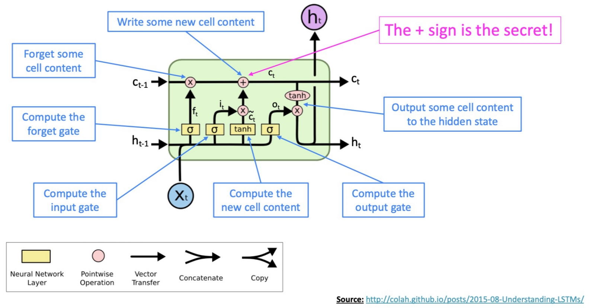
### 동작과정 설명
1. 입력처리
input gate에서 현재 입력과 이전 hidden state가 결합되어, 새로운 정보를 얼마나 cell state에 반영할지 결정한다.
2. 정보 삭제
forget gate를 통해 이전 셀 상태에서 불필요한 정보를 삭제한다.
3. 새로운 정보 추가
input gate를 통해 선택된 정보를 기존 cell state에 추가하여, cell state가 업데이트된다.
4. 출력 생성
output  gate는 현재 cell state와 입력 정보를 바탕으로, 어떤 정보를 출력할지 결정한다. 이 출력은 다음 시간 단계로 전달된다.

> 기울기 손실 문제는 direct connection을 사용하여 개선할 수도 있다.

## Bidirectional RNN 
시퀀스의 앞, 뒤 정보를 모두 사용하여 더 나은 예측을 수행할 수 있도록 고안된 RNN 구조이다.

### Bidirectional RNN 특징
2개의 RNN을 사용하여 양방향 처리한다.
- Forward RNN : 데이터 시퀀스를 왼쪽에서 오른쪽으로 처리하며, 과거부터 현재까지의 정보를 학습한다.
- Backward RNN : 데이터 시퀀스를 오른쪽에서 왼쪽으로 처리하며, 미래부터 현재까지의 정보를 학습한다.
이 2개의 RNN이 독립적으로 학습한 정보를 결합하여, 현재 시점에서의 예측에 모두 반영한다.
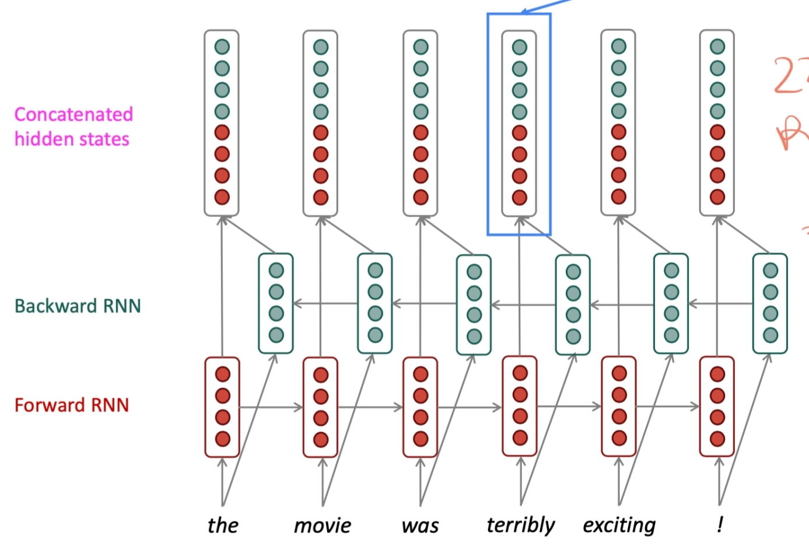

## Multi-Layer RNN(stacked RNN)
layer를 stack 형태로 쌓는 방식을 의미한다. 이를 통해 네트워크는 더 복잡한 표현을 계산할 수 있다.
(낮은 RNN은 낮은 레벨의 feature을 계산하고 높은 RNN은 높은 레벨의 feature을 계산한다.)
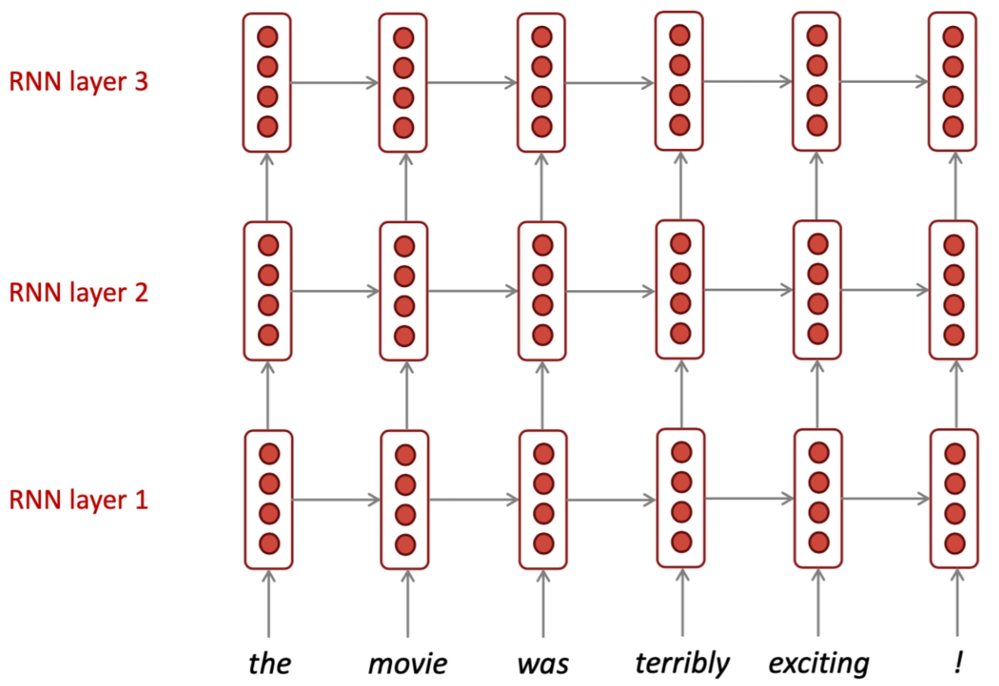

- 고성능 RNN은 일반적으로 Multi-layer이지만 CNN이나 feed-forward-network만큼 깊은 층을 가지지는 않는다.
- 일반적으로 encoder RNN은 2~4개 layer, decoder RNN은 4개 layer가 최적이다.
