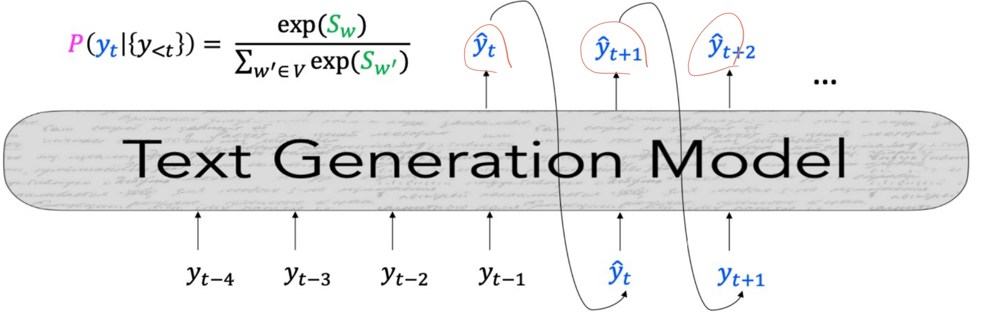
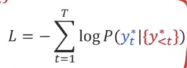
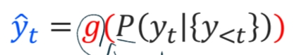
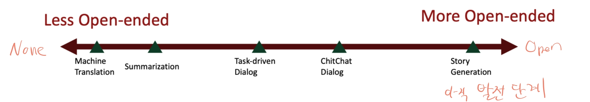
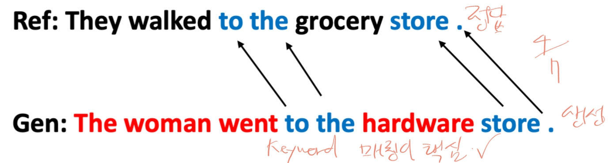
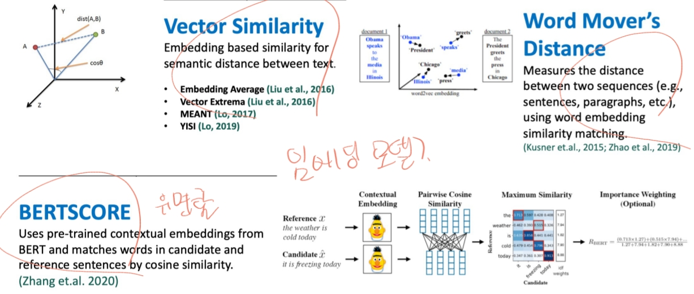
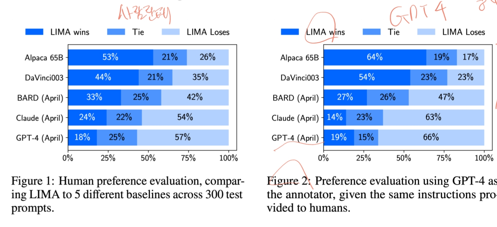

# Natural Language Generation(4)
자연어 생성은 자연어처리의 한 부분이며 인간을 위한 유용한 언어 출력을 생성하는데 중점을 둡니다. 
NLP(Natural Language Processing) = NLU(Natural Language Understanding) + NLG(Natural Language Generation)
 
텍스트를 생성하는데 이전 입력이 생성에 활용되는 autoregressive 개념이 적용된다.

## Language Model을 어떻게 학습하는가?
* 확률을 계산해서 확률분포가 나올텐데 거기서 정답분포와 유사해지도록 확률을 조정하게 학습을 시킨다.(모델이 예측한 값이 아닐 경우 낮아지게, 예측한 값일 경우 높아지게)
각 예측값마다 정답이 주어지기 때문에 teacher forcing이라고도 한다.
  

* 이미 학습된 모델에 추론 시 decoding 알고리즘을 적용한다. 그리고 같은 모델에 같은 g()를 쓰더라도 Greedy 같은 알고리즘이 아닌 이상 다르게 나올 수 있다.
 ex)Beam Search, Greedy
  

## Generation Example
1. Machine Translation System
2. Digital Assistant(dialogue) System
3. Summarization System
4. Creative Stories, Data-to-text
5. 가장 대표적으로 ChatGPT가 있겠다.

## NLG Task의 종류

위 그림을 보면 좌측으로 갈수록 입력에 따라 출력이 정해지는 경향이 있고, 우측으로 갈수록 출력이 자유분방한 경향이 있다.
중간에 있는 Dialog 또한 문제를 푸는 것에 집중되어 있다.(ex. ARS,은행 chatbot)

## 그래서 결국 Decoding이 뭐냐?
* voca에 있는 단어를 계산해서 스코어를 구한다.
* 스코어를 softmax 같은 것을 적용해서 확률분포를 구한다.
* 확률분포에서 Decoding 알고리즘과 결합을 해서 특정한 한 토큰을 고르는 행위이다.

## Generation의 일부 문제
종종 답변을 생성하다가 답변이 똑같이 계속 반복되는 증상들이 있다.
정해진 데이터셋을 학습하다보니 확증편향 문제도 발생한다.

### 어떻게 해결할 것인가?
* 휴리스틱한 방법으로 n번 이상은 자르는 n-gram
* 다양성을 고려한 sampling도 있다.
모든 토큰에 대해 랜덤하게 가져오는 방법도 있지만 Long Tail Problem이 생길 우려도 있다.(확률이 낮은게 다수 존재하는데 이걸 전부 합치는 전체적인 관점에서의 확률로 보면 크다.)
그래서 이럴 경우는 top-k 방법으로 일정 수준 이상에서만 뽑는 방법이 있다. 
그렇지만 top-k 또한 확률분포에 따라 자르는 수도 달라지는 동적인 방법이 좋은데 누적 확률 질량에 따라 자르는 방법이 있다.
* temperature 파라미터를 조정하여 확률분포를 얼마나 평탄하게 만들지 정할 수도 있다.
  1. temperature = 1 : 모델이 예측한 롹률 분포를 그대로 따른다.
  2. temperature < 1 : 확률분포를 더 극적으로 만들어 집중시키게 한다.(정답과 더욱 가깝게 됨)
  3. temperature > 1 : 확률 분포를 평탄하게 만들어 더 다양한 단어가 선택될 가능성이 커진다.(더욱 창의적)
* 부가적인 방법으로 Re-Ranking 방법이 있다.
의도적으로 여러개를 두고 Re-Ranking을사용하여 좀 더 안정적인 생성을 추구한다.
* 현재는 LLM 모델이 좋아져서 decoding 알고리즘 중요성은 좀 낮아졌다.

## NLG System의 평가
사실 소수의 사람이 평가하는 것도 극단적인 사람이 있을 수 있기 때문에 완벽하지는 않다.
평가 방법으로는 3가지가 있다.
1. Content Overlap Metrics
키워드 매칭이 핵심이고 생성된 문자와 사람이 작성한 것과 비교한다.
   
위 예시는 정답 7개 단어 중 4개가 매칭된다. 자동으로 계산해주기에 아직까지 쓰인다.
다만 문맥과 상관없이 문자만 같으면 점수를 주기 때문에 제한점이 있다.

2. Model-based Metrics
생성된 텍스트와 정답 텍스트 사이의 의미론적 유사성을 계산하기 위해 학습된 표현을 사용한다.
다만 행동이 해석 불가능하다.

   
3. Human Evaluations
결국 어느 정도는 사람에 의존할 수 밖에 없지만 비용이 많이든다. 자동 Metrics은 사람 평가와 연관이 되어 있어야 한다.
또한 전체적으로 혹은 특정 부분적인 차원에서 다양한 요소로 평가해야 한다. 다만 사람의 평가 또한 완벽하지는 않은게 결과가 항상 일정하지 않고 반복적이지도 않다.
그때그때마다 다를 수 있다는 얘기이다. 또한 비논리적이고 질문 자체를 잘못이해할 수 있다.

> 그렇다면 LLM 모델에게 평가를 맡겨볼까...?
> 실제로 사람과 GPT4에게 각각 질문을 했더니 기능이 비슷하게 돌아갔다.
> 

## NLG의 윤리적 이슈
GPT는 기본적으로 독성 콘텐츠는 작성 안하도록 필터링 되어 있지만 우회해서 모델을 폭주하게 만든다든지 사실오류를 만드는 등의 문제가 있다.
사실상 인공지능이라는게 사람과 유사하게 판단하고 작동하게 만드는데 편견과 편향이 없다는게 이상한게 아닐까라는 생각도 든다.
사용자와 prompt를 가지고 상호작용을 하기 때문에 이런 독성 내용에 대해서는 대응책들이 필요하다.