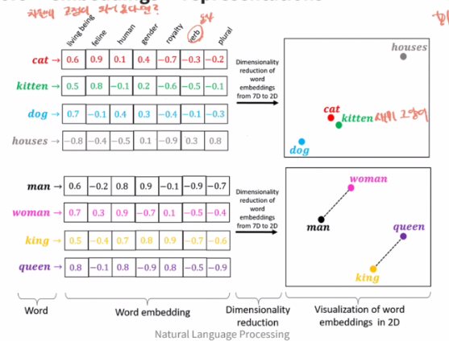
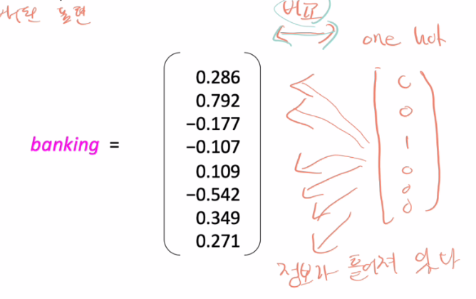
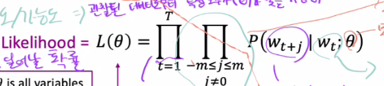
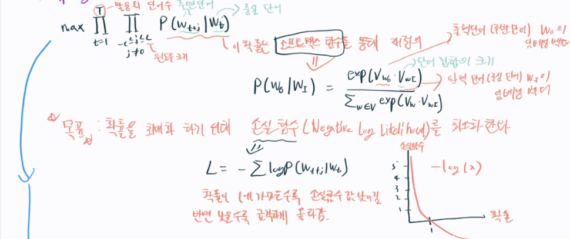
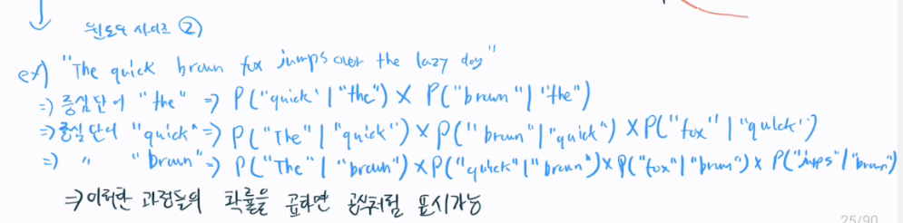
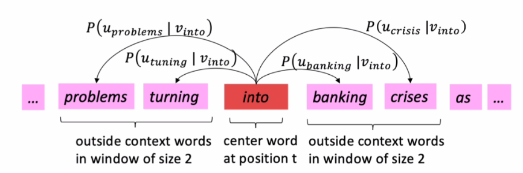
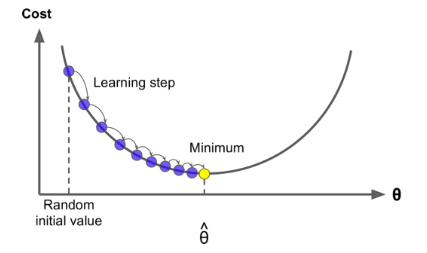
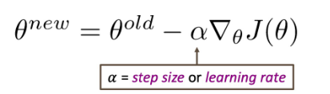

# NLP란 무엇인가?
- 자연어처리는(NLP)는 자연어를 통한 컴퓨터와 인간의 상호작용에 초점을 맞춘 인공지능 분야이다.
- 궁극적인 목적은 인간의 언어를 이해하고 해석하며 생성하는 것이다.

## NLP의 카테고리 {id="nlp_1_1"}
- Natural Language Understanding(NLU): 텍스트에 대한 깊은 이해가 필요한 문제를 해결한다.
  ( Encoder / 선제적인 연구 필요 / ex. 감정연구, 추천)
- Natural Language Generation(NLG): 우리와 대화하는 시스템을 개발(챗봇, 기계번역, 요약 등)
  ( Decoder / 사람처럼 된지 얼마 안됨)


## NLP의 도전과제 {id="nlp_1_2"}
자연어는 규칙적이면서도 불규칙적이다. 맥락에 기반한 의미와 밈이나 신조어 같은 언어들도 있다.
언어학, 통계학, 심리학 등 많은 학문과의 관련성도 존재한다.(고로 쉽지 않다.)


## Word Vector {id="nlp_1_3"}
문자를 숫자형태의 벡터로 변환하는 것
### **철학**
"Distributional semantics"<br/>
한 단어의 의미는 주변에 빈번히 나타나는 단어들에 의해 결정된다. 실제 데이터 상에서 단어가 유사한곳에서 많이 나타나면 벡터로 나타냈을 때 벡터공간에 비슷한 곳에서 나타나야 한다.(근묵자흑)
### **변환 방법**
단어가 언어를 다루는 방법은 아래와 같다.
- 컴퓨터는 숫자만 처리가 가능해서, 자연어를 숫자 형태(벡터)로 변환해야 한다.
- 자연어의 기본 단위는 Word이다. 문장, 단락, 문서와 같은 개념을 구축하기 위해 다른 단어들을 결합한다.

{ width=450 }{border-effect=line}

### **변환 방법들**
1. 정수 인코딩(Integer Encoding)
주어진 단어들에 번호를 각각 고유하게 부여한다. 연관성 파악이 어렵다.

2. One Hot Encoding
벡터 차원에서 단어에 숫자를 부여한다. Sparse Vector라고도 불리며 메모리 부족, 연관성 파악 어려움이 있다.
ex) motel = [0 0 0 0 1 0 0]
   hotel = [0 0 0 0 0 0 1]
<br/>
```  만약 Seoul motel을 검색하면 Seoul hotel도 나오길 기대하지만 유사함을 유추하기가 어렵다. 두 벡터는 수직이다.(orthogonal)```

3. Dense Word Vectors
각 단어를 dense vector로 만들고, 유사한 맥락에서 나타나는 단어들의 벡터와 유사하도록 한다.
{ width=290 }{border-effect=line}

### **Word2Vec**
Word2vec은 Word Vector를 학습시키기 위한 프레임워크이다.
변환 과정은 아래와 같다.
1. 말뭉치로부터 각 단어들을 고차원 실수 벡터로 변환합니다.
(자연어 처리용 단어 임베딩 생성)

2. center word와 context word의 벡터값 연산을 통해 단어들간의 의미가 유사한지 확인합니다.
(의미적 관계, 유사도 파악)
3. 확률을 최대화하기 위해 단어 벡터를 조정합니다.

즉, `말뭉치의 근접성(Data likelihood)`을 `word vector의 유사도(Dot Product)`와 연결한다!

> 1. **Data likelihood**(사건이 일어날 확률)
>    { width=350 }{border-effect=line}
> 어렵게 생각할 것 없음. P()는 확률로 보면 됨. 중심 단어를 기준으로 주변 단어가 올 확률임. 그리고 윈도우 크기 만큼 loop해서 확률을 전부 곱해줌. 이 과정을 말뭉치 단어 수 만큼 반복해서 전부 곱해주면 원하는 확률.
> 
> 풀이
>    {border-effect=line}
>    {border-effect=line}
>    {border-effect=line}
> 
> 2. **More details**
> - CBOW(Continuous Bag of Words), Skip-gram 모델이 있는데 window 크기를 기준으로 CBOW는 context word로부터 center word를 예측합니다. 반면 Skip-gram은 center word로부터 context word를 예측합니다.
> Skip-gram이 상대적으로 느리지만 더 다양한 학습을할 수 있어 효과적입니다.(위 정리 기준도 skip-gram)
> - 손실함수를 최소화하기 위해 경사하강법 알고리즘이 사용됨. 최소한 local minimum이라도 찾자.

<br>

### **Word Vector에 대한 평가는 어떻게 하는가?**
이론적으로 만들어진 것을 평가하는건 평가하기도 어렵다. 실생활에 얼마나 도움이 되는가로 평가한다. 혹은 성능적인 개선?
약간 개발 테스트에서 단위테스트인지 통합테스트인지 차이인듯.

1. **내재적 평가**: 특정/중간 하위 작업에 대한 평가
- 특정/중간 하위 작업에 대한 평가
- 계산이 빠르다.
- 그 시스템을 이해하는데 도움이 된다.
- 실생활에 도움이 되는 상관관계가 확립되지 않는 한 정말 도움이 되는지 모른다.
- ex) 두 단어 간의 유사성(코사인 유사도, 유클리드 거리), 단어 유추(king - man + woman = queen)

2. **외재적 평가**
- 실제 작업에 대한 평가. 자연어 처리에 얼마나 좋은 성능을 내는가? (이게 중요하다!)
- 정확도를 계산하는데 오래 걸릴 수 있다.
- subsystem이 문제인지 상호작용이 문제인지 알 수가 없다.
- ex) 텍스트 분류(단어 임베딩을 사용하여 성능 평가)

> **경사하강법(Gradient Descent)**
> 경사하강법은 J(𝜃)(cost를 나타내는 비용)을 최소화 하는 알고리즘이다.<br>
> 𝜃는 모델 매개변수를얘기한다. (ex. weight bias...)
> 
> 
> 
> 매개변수를 업데이트 해주는 수식은 아래와 같다.
> 

<br>