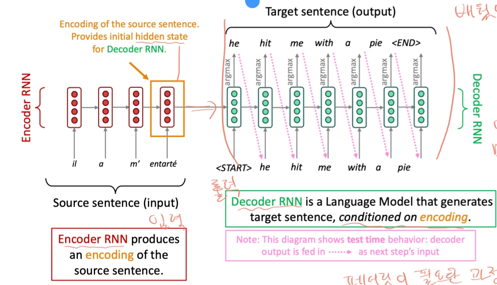
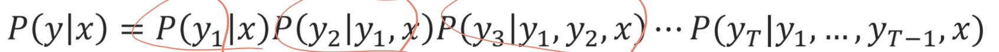
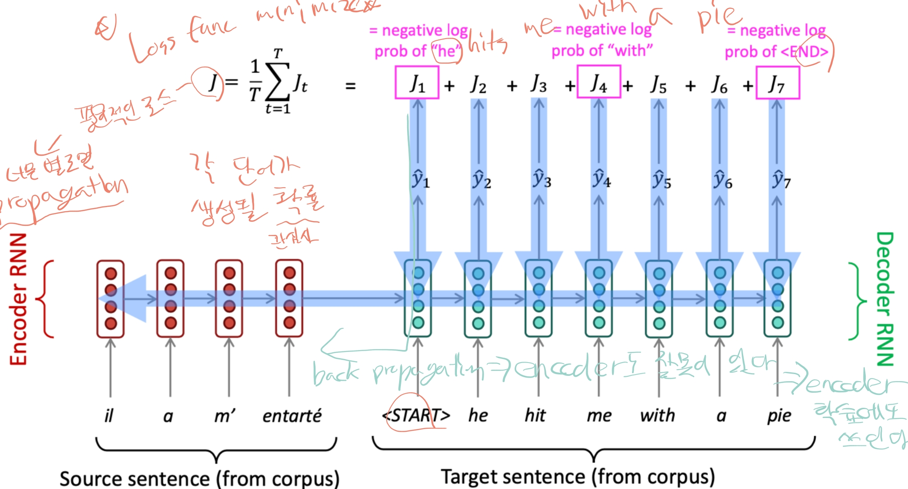
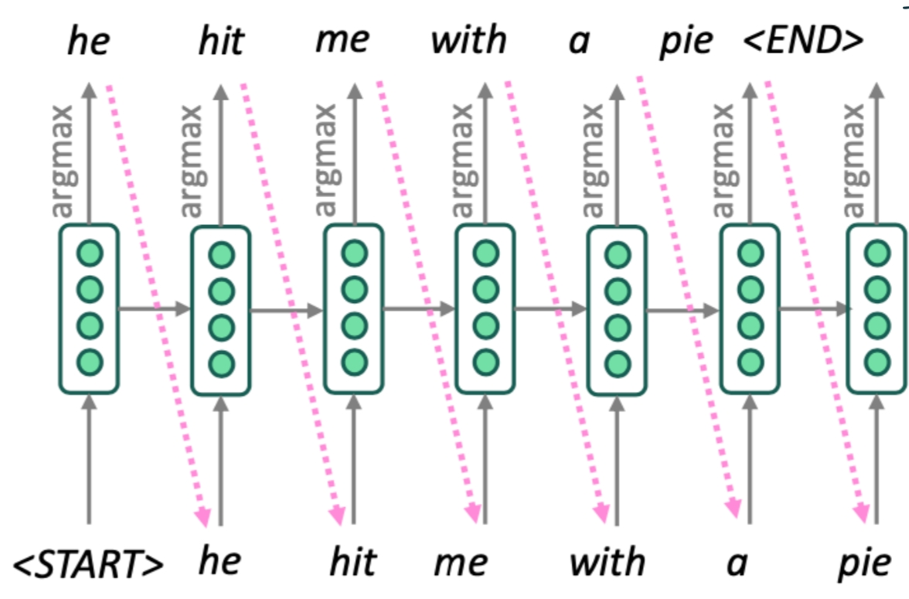
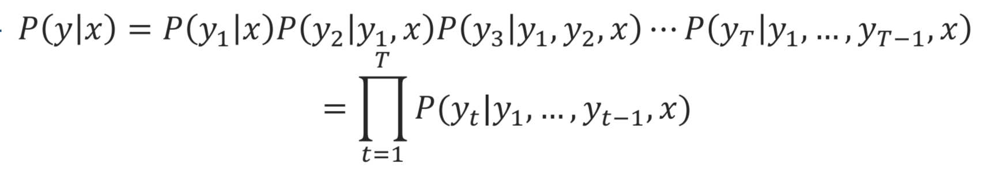
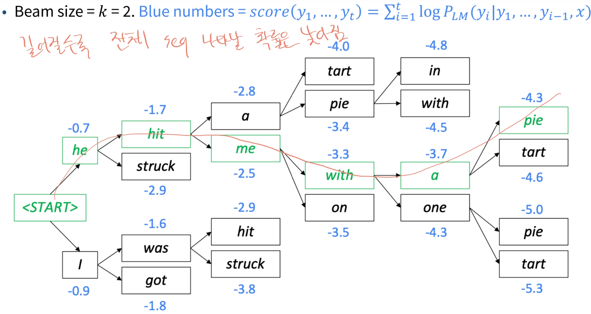

# SeqToSeq(2)
## Machine Translation
Source language에서 문장 A를 다른 Target language로 번역하는 작업이다.
처음엔 단순히 단어 치환으로 시작했다.
### Neural Machine Translation
Neural Machine Translation은 단일 end-to-end 신경망을 사용하는 Machine Translation이다. 이는 sequence-to-sequence 모델이라고 불리고 두개의 RNN을 포함한다.

Encoder RNN과 Decoder RNN이 있고 각 역할은 아래와 같다.
1. Encoder
입력 시퀀스를 고정 길이의 벡터 표현으로 변환한다. encoder의 마지막 단계에서 나오는 hidden state가 입력 시퀀스의 전체 정보를 압축한 벡터로서 디코더로 전달된다.

2. Decoder
encoder에서 전달된 hidden state를 초기 상태로 받아, 목표 출력 시퀀스를 하나씩 예측하는 역할을 한다.

* SeqToSeq는 요약, 대화, 코드 생성과 같은 다양한 task에서 활용 가능하다.
* SeqToSeq는 conditional language model이라고 할 수 있다.(소스 문장을 기반으로 다음 언어를 예측)
* 확률 수식은 아래와 같다.

* NMT 학습 방법(Backpropagation)

Loss func을 구하고 최소화하기 위해 반복적으로 학습한다. 평균 Loss가 별로면 Backpropagation 한다. 기본적으로 훈련은 순차적으로 진행되기에 encoder도 잘못이 있다.

### Machine Translation 평가는 어떻게 할까?
1. BLEU(BiLingual Evaluation Understudy)
BLEU는 기계가 작성한 번역을 하나 또는 여러 개의 인간이 작성한 번역과 비교하고 유사도를 계산한다(n-gram 활용). 유용하지만 키워드 매칭 방식이기에 한계가 있어 완벽하지는 않다.
   * 예시 : "I love mahcine learning"이고 2-gram일 경우 "I love", "love machine", "machine learning"이다. 

### Greedy Decoding
decoder에서 문장은 생성하는 방식 중 하나이다. 탐욕적인 방식으로 각 순간에 확률이 제일 높은 것으로 선택하는 방법이다.

다만 순차적으로 생성하다보니 하나 잘못나오면 다음 단어도 잘못나오는 한계가 있다. 그리고 <End>token이 나올 때까지 생성한다.

### Exhaustive Search Decoding(완전 검색 디코딩)
모든 경우의 수를 고려해서 최적의 해를 찾는 방법인데 크기가 조금만 커져도 계산량이 많아지기 때문에 현실적으로 사용하기엔 적합하지 않다.
수식은 아래와 같다.

### Beam Search Decoding
미리 정해진 수 K(beam size)만큼의 상위 후보만 선택하여 탐색하는 휴리스틱 기반 탐색 알고리즘이다. 보통 beam size의 실용적인 사이즈는 5~10이다.
Exhaustive Search Decoding에 비해 가능성이 가장 높은 K개 후보만 선택하기 때문에 계산 복잡도가 훨씬 낮습니다. 점수는 log를 붙여서 계산하고 항상 음수이면서 점수가 클수록 좋다.
hypotheses(가설)이 너무 길어질 경우 점수가 낮아지기에 정규화를 해준다.
항상 최적의 해를 구하는게 보장되는건 아니지만 그럴듯한 해를 구해주고 훨씬 효율적이다. 그리고 끝 도달 시점은 n개의 정해진 수 or timestamp를 정한다.

