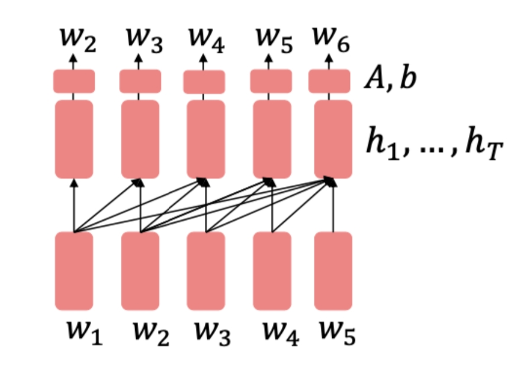
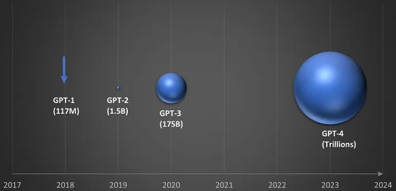
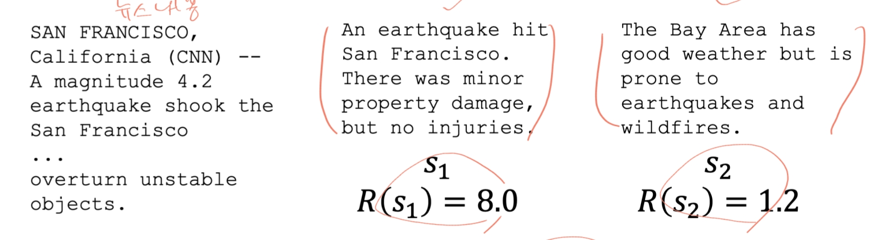

# Tokenization And Subword Modeling
Tokenization 이전까지는 word 단위로 했는데 word 단위는 약간의 오타에도 대응하기가 힘들고 모르는 word가 있을 경우 문제가 있어 subword 단위로 한다.
그리고 모르는 단어의 경우 Unknown으로 매핑한다.

> 토큰은 텍스트를 구성하는 기본 단위이다.
> 중복을 제거한 단어의 수를 **Types**이라고 한다. **Token**의 경우 모든 단어의 수를 말한다.
> 예를 들어 "They picnicked by `the` pool, then lay back on `the` grass and looked at `the` stars." 문장에서는 `the`가 중복되어 있으니 Token은 16, Type은 14개이다.

## Issues in Tokenization
* 영어단어는 대부분 공백문자로 구분되는데 아닌 경우도 충분히 있다.
예를 들어 "rocknroll", "i'm"이 있고 중국어나 일본어는 공백문자가 없다.
* 토큰과 단어는 비슷한 개념으로 사용될 수도 있으나 같지는 않다. 무슨말이냐면 토큰은 시퀀스에서 시작하여 최소단위 byte까지 쪼개질 수 있다.
단위에 따라 장단점이 있으므로 적당한 수준을 정해야한다.
  
* 토큰화 단계를 세분화하면 아래와 같다.
  1. Coarse-grained(words): 빽뺵하고, 직관적이며, 단어사이즈가 커진다. Unknown 토큰인 "UNK"을 가질 수 있다.
  2. Subwords(중간정도): 의미를 유지하는 선에서 나누는 방법 등이 있다.
  3. Fine-grained(characters, bytes): token 크기 자체는 가장 작고 나타내는 의미가 없다. 토큰 사전은 작아지며 변화가 거의 없다. 영단어의 알파벳 생각하며 된다.
     

## Tokenization Algorithms
1. Byte pair encoding(BPE)
가장 널리 쓰이는 알고리즘이며 하위 단어(subword) 단위의 토큰화를 수행하는 기법이고, 표현 능력과 효율성 사이의 이상점을 찾고자 한다.
   * 수행절차는 아래와 같다.
     1) 모든 단어를 char 단위로 쪼갠다.(apple -> a, p, p, l, e)
     2) 가장 자주 등장하는 인접한 문자쌍을 찾고, 같은 수가 있을 경우 임의로 우선순위를 정한다.
     3) 병합하여 새로운 임의의 subword를 생성한다.(pp -> X, aXle)
     4) 반복하고자 하는 횟수만큼 반복한다.
     5) 최종적으로 voca = 원래 char 수 + 새로 생성한 subword 수
   * 예시는 아래와 같다.
     aaabdaaabac -> (aa -> Z) ZabdZabac -> (ab -> Y) ZYdZYac -> (ZY -> X) XdXac
2. Unigram Language Modeling
3. WordPiece

## Motivating Model Pretraining From Word Embeddings
자연어처리에서 사전학습이 나오게 된 배경은 데이터 부족, 모델 학습의 효율성, 문맥 이해의 필요성이다.
사전학습에서 훈련하는 예시들은 아래와 같다.
* 한양대학교는 한국 서울시 __에 위치한다.(기본적인 예시)
* I put __ fork down on the table(문법) > 관사나 소유대명사
* The woman walked across the street, checking for traffic over __ shoulder.(동일 지시어) > 소유대명사
* I went to the ocean to see the fish, turtles, seals, and __.(lexical semantics-어휘의 의미론) > 문맥상 해양 생물
* Overall, the value I got from the two hours watching it was the sum total of the popcorn and the drink. The movie was __.(sentiment-정서) > 문맥상 부정적인 느낌의 단어가 와야함
* Iroh went into the kitchen to make some tea. Standing next to Iroh, Zuko pondered his destiny. Zuko left the __.(some reasoning-추론)
* I was thinking about the sequence that goes 1,1,2,3,5,8,13,21, __.(수학적 이해-피보나치 수열)

## Pretraining and Finetune

## 모델 사전훈련의 세가지 방법
신경망 구조는 pretraining type 선정에 영향을 주며, 각자 장단점이 있다.
1. **Encoders** 
입력된 텍스트를 고차원 벡터 표현으로 변환하는 역할을 하는 구조이다. 주로 텍스트의 문맥적 의미를 학습하는데 중점을 둔다.
일반적으로 Masked Language Model(MLM) 방식으로 사전 학습이 이루어집니다. 
입력 문장의 일부 단어를 마스킹하고, 문맥을 이용해 그 단어를 예측하는 과정을 통해 문맥을 이해합니다.
   

> 한계는? 
> 이해를 위한 모델이라 생성에는 약하다.
 
> 파생 모델 
> RoBERTa: BERT를 더 오래 훈련시키고 다음 문장 예측을 제거함. 
> SpanBERT: 연속적인 span을 마스킹한다.

2. Encoder-Decoders
Encoder는 입력 텍스트를 고차원 벡터로 encoding하고, decoder는 벡터로부터 새로운 텍스트를 생성한다. 주로 번역이나 SeqToSeq에서 사용한다.

3. Decoders
주로 텍스트 생성을 목적으로 사용되는 구조이다. 자동 회귀 모델로 작동되며, 이전 단어들을 바탕으로 다음 단어를 예측하는 방식이다. GPT와 같은 모델이 이 구조에 속한다.
   
2018년 GPT는 사전훈련하는데 큰 성공을 이루었다. 성공하고 계속 발전해가는 근본적인 이유는 바로 방대한 데이터를 학습하는 것이다.
계속 발전하다보니 GPT-3에서 특이점이 왔고 task를 해결하는 LLM의 형태가 되었다.

## Zero Shot & Few Shot In-Context Learning
in-context learning의 대표적인 모델로 GPT-3, GPT-4, LLaMa 같은 모델들이 있습니다. 이전의 BERT와 같은 모델들은 특정 task를 수행하려면 task에 맞게 재훈련이나 fine-tuning이 필요했습니다.
이는 비용이 많이 소요될 수 있으며, 각 task마다 버전을 유지하는 것 같은 소요가 있습니다.
반면에 in-context learning은 엄청난 양의 데이터를 pre-training하고 gradient steps이 없이 주어진 prompt context를 활용하여 다양한 task를 수행할 수 있습니다.
추가적인 step이 필요 없으므로, 더욱 유연하고 비용이 줄어들어 효율적입니다. 그리고 prompt context에 예시를 몇 개 주냐에 따라 zero-shot과 few-shot이 있습니다.
특정 task에 대해 답변이 가능한 건 학습된 데이터 중 그런 유형의 데이터가 있기 때문이다.

일부 답변이 어려운 task가 있을 수도 있다(다단계적인 추론 같은... 수학?). 해결방안은 prompt을 chaining 해서 잘 작성하는 것이다. 

## Instruction Finetuning
모델이 주어진 지시사항에 따라 더 정확하고 일관되게 응답할 수 있도록 학습하는 기법이다. 언어모델이 유저가 항상 의도한 것과 일치하게 결과를 내는게 아니기 때문에
지도학습과 비슷한 형식으로 fine-tuning을 하는데 사용자의 의도에 맞게 더욱 정확하고 유용하게 개선하는게 목표이다. 이를 위해 다양한 task에 대한 지시문과 적절한 응답으로 구성된
데이터셋을 사용하는데 가이드라인을 준다라고 표현할 수 있습니다.
하지만 Instruction Finetuning에도 한계가 있습니다. 
양질의 데이터를 모으기가 비싸고, 열린 결말과 같은 소설이나 답이 없는문제,사람들이 좀 더 민감하게 반응하는 주제와 같은 것들이있기에 사람의 선호도에 대한 만족도를 높이기가 어렵습니다.

## RLHF(Reinforcement Learning from Human Feedback)
Instruction Finetuning에서 나타나던 단점을 극복하기 위해 사람들의 선호도를 고려하여 모델을 개량, 강화 학습하는 것이다.
아래 예시는 뉴스 내용을 요약하는데 보상 점수를 최대화 하는 방향으로 선택한다고 보면 된다.

수식으로 표현하면 아래와 같다.

위 수식을 결론적으로 아래 수식으로 바꾼다.

여기서 수식이 말하고자 하는 것은 expectation값을 미분하는 것보다 미분한 값을 expectation 수식에 적용하는게 더 쉽다! 이러한 기법을 사용했다!

 
그럼에도 불구하고 인간에게 직접 선호도를 식별하게 하는건 비싸다. 그러므로 인간의 선호도를 구분하는 모델을 새로 만들어야 한다!
그리고 사람의 판단은 항상 정교하지 않으니 비교쌍으로 스코어를 산출하자. 선호도 또한 모델 사이즈가 커질수록 사람 선호도와 유사하게 근사된다.

 
RLHF의 스케일링 업 케이스로 InstructGPT가 있다. 사용자 지시에 맞게 더 정확하고 유용한 응답을 제공하기 위해 훈련된 모델이다.
프로세스는 아래와 같다.
1. 감독 학습(Supervised Fine Tuning)
- 데이터 준비(인간 어시스턴트가 제공한 지시와 답변의 데이터셋)
- 모델 학습
2. 보상 모델(Reward Model) 학습
- 데이터 수집(모델이 생성한 답변 중 평가자들이 가장 적절하다고 생각하는 데이터셋을 만듬)
- 보상 모델 학습(각 응답에 점수를 매기도록 학습)
3. 강화 학습(Policy Optimization)
- 보상 모델을 기준으로 모델의 출력을 최적화한다.
- 모델 업데이트(개선된 응답을 생성하기 위한 학습, 반복적인 업데이트)

 
이렇나 노력에도 인간의 선호도는 주관적이기 때문에 문제가 있다. 보상을 해킹하는 문제도 있는데 사실과 다르게 이상한 방향으로 도움이 되는 거섳럼 하고 보상을 받는게 있다.