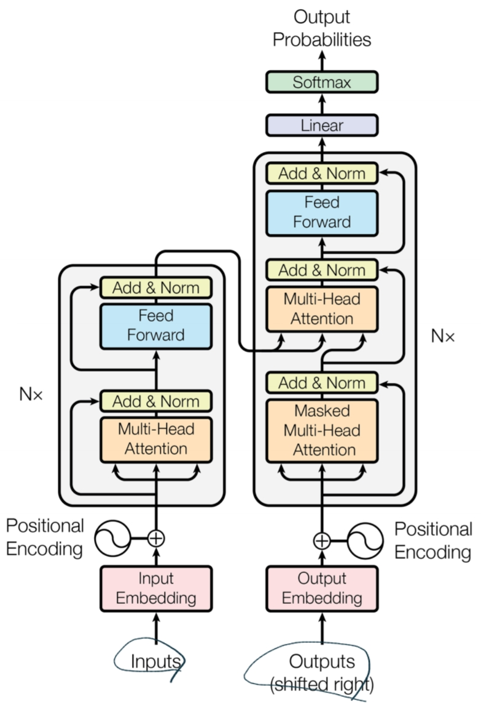
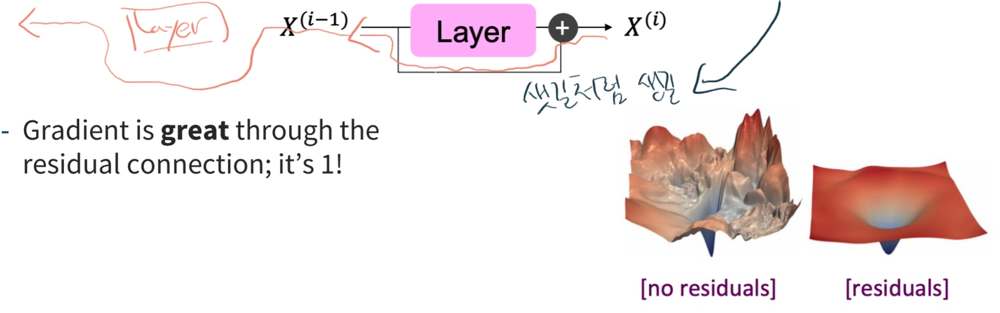
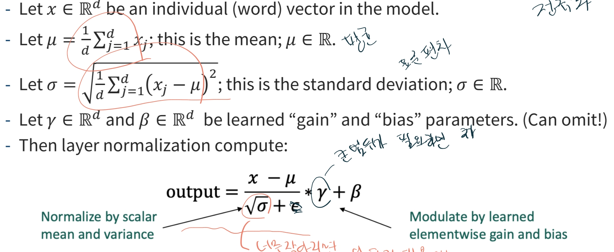
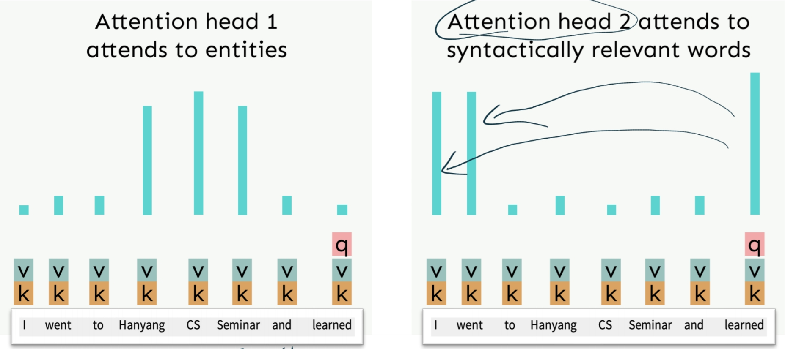
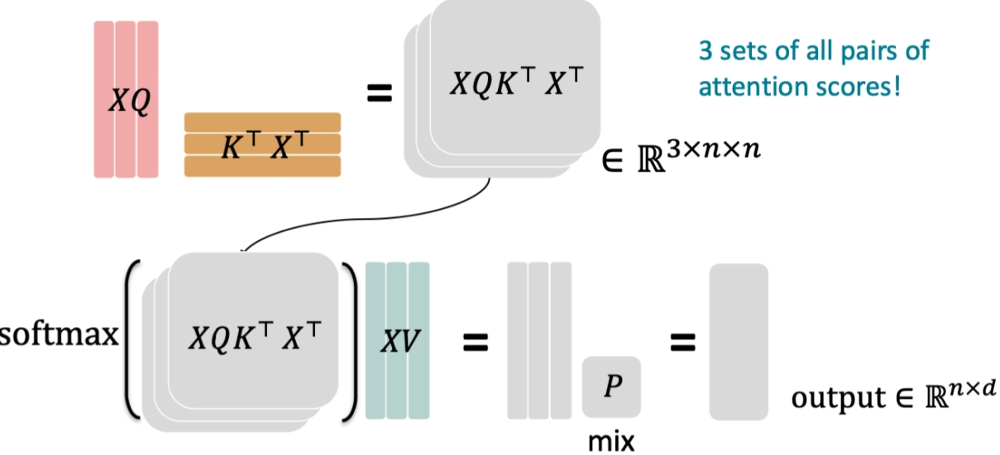
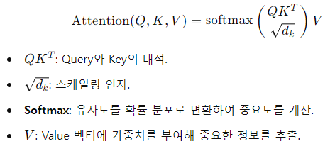
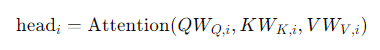
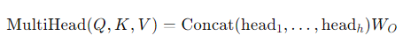
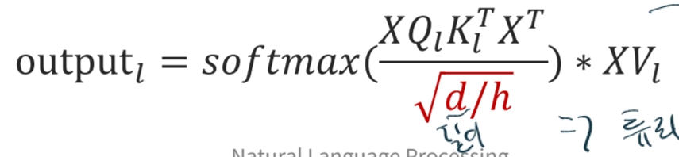

# Transformer(2)
자연어 처리에서 사용되는 혁신적인 모델이며 아래와 같은 특징이 있다.
* **병렬처리**가 가능해 모든 단어를 동시에 처리할 수 있어 학습 속도와 성능이 크게 향상되었다.
* **Self-Attention**을 사용하여 각 단어가 다른 단어와 연관 관계를 학습하여 멀리 떨어진 단어와의 상호작용도 가능하다.
* Positional Encoding을 사용해서 입력 시퀀스의 순서 정보를 유지한다.

## Transformer Architecture

Decoder의 아키텍처를 보면 Self-Attention과 유사하다.
다만 특이하게 Add & Norm이 들어가 있는데 최적화 기법 중 하나이고 **잔류 연결** 및 **계층 정규화**를 통해 비슷한 의미를 가지도록 한다.

> 1. 잔류 연결(Residual Connection)
> vanishing gradient을 개선하고 모델이 학습을 더 잘하게 돕는 기법이다.
> 
> 2. 계층 정규화
> 평균과 표준편차로 정규화하여 변동성을 줄여 학습을 더 잘하게 돕는 기법이다.
> 

## Multi-Head Attention
Multi-Head Attention은 Transformer 모델에서 핵심적인 역할을 하는 구성 요소로, 입력 시퀀스의 여러 부분에 동시에 집중할 수 있도록 해준다.
기존 Self-Attention 메커니즘을 확장한 것으로, Single Attention 대신 여러 개의 Attention 분포를 병렬로 학습할 수 있게 한다.

### 동작방식

1. 입력 프로젝션 
입력 시퀀스를 여러 서브스페이스로 투영하기 위해 각 헤드마다 서로 다른 선형 변환을 적용한다.
즉, 헤드마다 별도의 Query, Key, Value 행렬을 생성한다.

2. 계산 
각 Attention Head가 자체적인 Attention score를 계산하고, 해당 서브스페이스에 value의 가중합을 구한다.
   
   
   
3. 결합 
모든 Attention Head의 출력을 하나로 결합한다.
   

4. 최종 선형 변환 
결합된 출력을 선형 레이어에 통과시켜 최종 Multi-Head-Attention output을 만든다.

> 차원이 커지면 벡터 간의 점곱이 커지는 경향이 있어 softmax에서 기울기가 작아질수 있다.
> 그래서 휴리스틱한 방법으로 attention scoredp 수식을 추가해 개선하는 방법이 있다.
> 
 
## Cross Attention
두 개의 다른 시퀀스 사이의 연관성을 학습하기 위한 메커니즘으로, 입력 시퀀스와 출력 시퀀스 사이의 상호 작용을 파악할 때 사용된다.
특히 Transformer 모델의 encoder-decoder 구조에서 주로 활용되며 encoder 정보를 decoder로 전달하는데 사용된다.

|-|-|-|
|구분|**Self-Attention**|**Cross-Attention**|
|**기본개념**|시퀀스 내의 요소들 간의 관계를 파악|두 시퀀스 간의 상호작용 및 관계를 파악|
|**Query**|	동일한 시퀀스의 각 요소에서 생성|	디코더 시퀀스의 각 요소에서 생성|
|**Key**|동일한 시퀀스의 각 요소에서 생성|인코더 시퀀스의 각 요소에서 생성|
|**Value**|동일한 시퀀스의 각 요소에서 생성|인코더 시퀀스의 각 요소에서 생성|
|**사용되는 위치**|	Transformer의 인코더와 디코더 내부|Transformer의 인코더-디코더 사이|
|**목적**|시퀀스 자체의 컨텍스트를 파악하고 표현 강화|입력 시퀀스(인코더)의 정보로 출력 시퀀스(디코더) 생성|
|**의존관계**|한 시퀀스 내에서의 단어들 간의 관계 파악|두 시퀀스 간의 의존 관계 파악|
|**예시**|문장 내 단어들의 상호 관계 학습|번역 모델에서 원문과 번역문의 상호작용|
|**활용분야**|자연어 처리(NLP), 음성 인식, 문장 이해 등|기계 번역, 텍스트 요약, 인코더-디코더 구조 모델|
